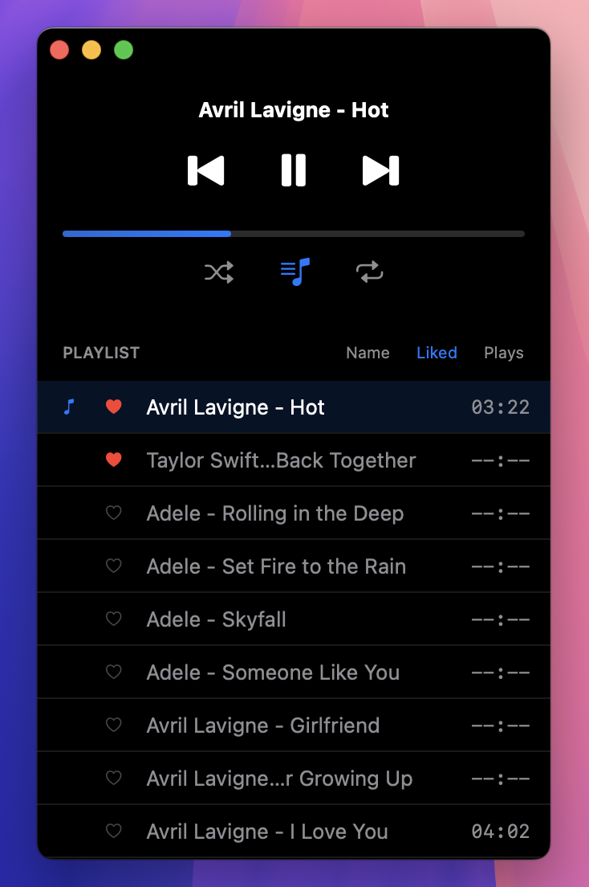

# Hex Player

A modern, minimalist local music player for macOS.

[中文说明文档 (README_zh.md)](README_zh.md)

## Warning:
When you encounter "hexplayer.app cannot be opened because it is from an unidentified developer," don't worry - this happens because the software is not signed. Go to "System Preferences," select "Security & Privacy," and click "Open Anyway."

Why isn't it signed? - Because I don't want to pay for a certificate ($99 per year).

Concerned about security? - The code is open source - feel free to compile it yourself.

## Download

Visit [Latest Release](https://github.com/ahxj/hexplayer/releases/latest) to download the version suitable for your system:

- **hexplayer.app** - Universal architecture version
- **hexplayer-arm64.app** - Optimized version for Apple M series chips

> Recommendation: Mac users with M chips should use the arm64 version, other Mac users should use the universal version.

## Features

- ✅ Compatible with macOS 12.4 and above
- ✅ Minimalist interface, focused on music playback experience
- ✅ Lightweight design - arm64 version only 500KB
- ✅ Extremely low system resource usage, optimized CPU and memory utilization
- ✅ Playlist support with sorting by play count
- ✅ Liked songs functionality to quickly find your favorite music
- ✅ Import and export support for favorite song playlists

## Format Support Information

Hex Player uses AVFoundation for audio decoding, supporting most common audio formats. To maintain software simplicity, no additional decoding libraries are integrated, therefore:

- Some uncommon formats like opus, ogg, etc. may have compatibility issues
- For broader format support, consider using players with integrated third-party decoding libraries like ffmpeg

## Update Plans

Development focus will be on:
- 🛠️ Bug fixes
- ⚡ Performance optimization

## Feedback and Support

For issues or suggestions, please submit feedback through GitHub Issues.